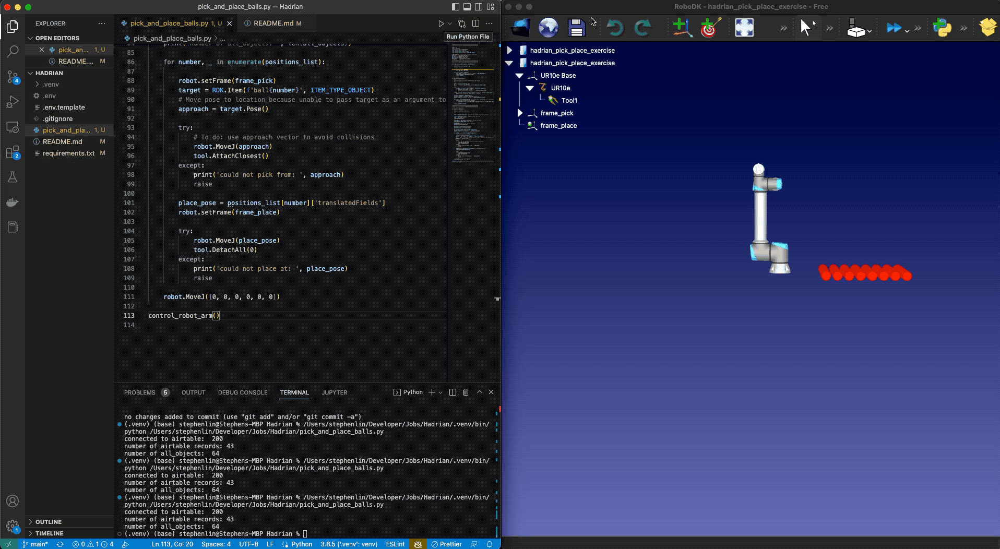

### To replicate:
1. Start virtual environment
2. From project directory root run `pip install -r /path/to/requirements.txt`
3. Create a `.env` file based off of `.env.template` and add Airtable config variables
4. Download `hadrian_pick_place_exercise.rdk` station file and open it in RoboDK
5. From project directory root run `python3 pick_and_place_balls.py`

### Updates and notes:
#### 11/7/22
Refactored a couple small details and updated the scaling to show the full pattern while accounting for ball diameter. To do:
* Refactor functions into a class that could be called from another script
* Load station file from script

#### 10/30/22
In the interests of time, I ignored potential real-world constraints/collisions with the x-axis surface.  To do:
* My next step would be refactor this by finding an intermediate pose/approach from above frame_pick.  